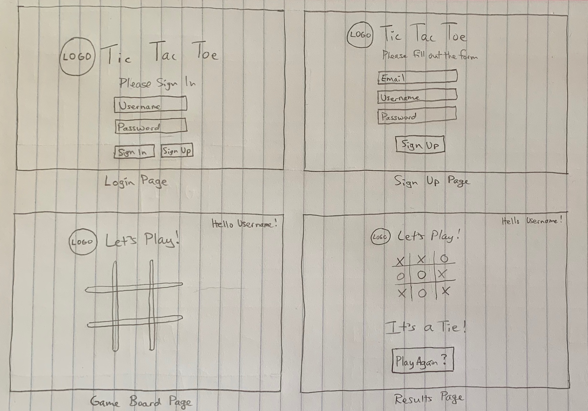
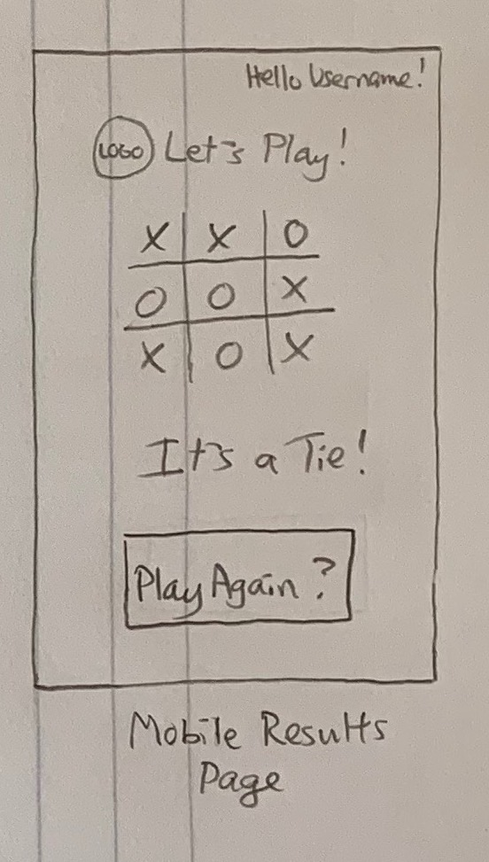

# Tic-Tac-Toe Client Application

Tic Tac Toe is a 2-player game where players take turns placing X's or O's on a 3x3 game board, with the objective of getting 3 symbols in a row.

## Technologies Used

- JavaScript
- jQuery
- HTML
- Bootstrap
- Flexbox
- CSS
- Sass
- Bash
- curl

## Planning and Problem Solving

Planning for this project started with basic wireframes (shown below) to guide the different "pages" planned for this single page application. Next came ideation for how to make the game board interactive for the user, and how to process user inputs to feed into the game engine. The main challenge for the game engine was writing clean logic for determining the winner without a lengthy chain of conditionals. Finishing touches included styling and adding additional features to enhance the user experience.

## Unsolved Issues

The application was made mobile-friendly in terms of sizing through the use of media queries, but the game-board does not maintain a precise 1:1 aspect ratio during resizing. This could be fixed in further iterations through refined styling rules and techniques.

## Wireframes and User Stories

### Desktop Wireframes

### Mobile Wireframe Results Page

### User Stories

- As a user, I can sign up for an account and log in to save my game data.
- As a user, I can see feedback on which player won the game.
- As a user, I can see statistics of my past games played.
- As a user, I can start a new game immediately upon completion of a game.
- As a user, I can easily use this application from devices of various screen sizes.
- As a user, I can choose my game-piece or symbol (not just X or O).
